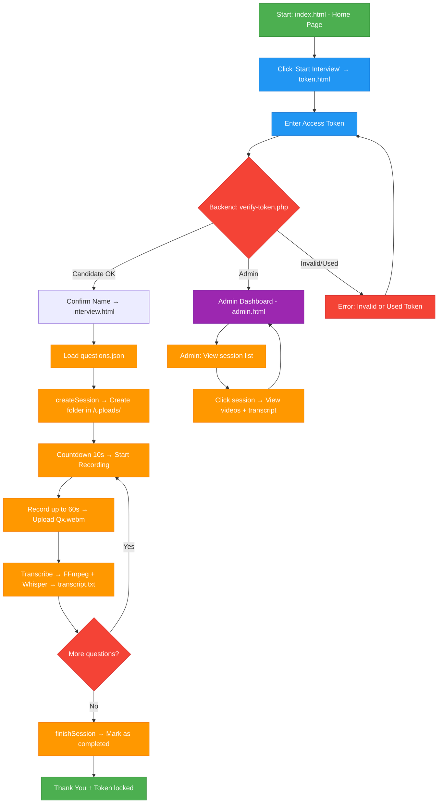

# INTERVIEWING WEB
# Overview

`web_phong_van` is a website used to provide interviewers with an online interview method and to store interview results.
This project aims to make the interviewing process easier. Candidates can participate in multinational interviews without needing to travel for an in-person interview. For employers, the website helps them save time and manpower during the recruitment process; in addition, the website allows employers to store the interview results of candidates.
# 1. Main Project Structure
## 1.1 Main Project Structure (From Repository)

Root Level:
index.html (homepage), token.html (token verification), interview.html (interview page), admin.html (admin dashboard), questions.json (list of questions).

/js/:
recorder-v3.js (recording logic, timer, upload), recorder.js (old version).

/Backend/api/:
PHP API files including:
verify-token.php, session-start.php, upload-one.php, transcribe.php,
session-finish.php, admin-api.php, contact.php.

/data/:
tokens.json, used_tokens.json, questions.json (backup),
contact-messages.txt, interviewee.xlsx.

/utils/:
`generate_tokens
## 1.2 Main Features

- Generate separate tokens for each candidate in the provided list.
- Candidates use the token to verify and participate in the interview.
- Record the candidate’s answering process for each question.
- Limit the preparation time and the answering time.
- Store the results after completion with the candidate’s name and the interview start time.
- Convert the candidate’s speech to text (Only works when the language is English).

## 1.3 Technologies Used

- Front-end: HTML / CSS / Javascript / JSON
- Back-end: PHP / FFPRESET, whisper AI
- Excel file to provide the candidate list. Python to generate tokens.

## 1.4 Overall Workflow
The project has two main flows: Candidate and Admin.
It follows a client–server model: frontend calls backend APIs via fetch, backend stores data in lightweight JSON/txt files.

### Candidate Flow
- Step 1 — Home Page (index.html)

  - Show introduction + contact form.

  - User clicks Start Interview → goes to token.html.

- Step 2 — Token Verification (token.html)

  - User enters token

    Frontend sends:

    POST → Backend/api/verify-token.php


  - Backend checks tokens.json:

If admin token → redirect to admin.html

If candidate token:

validate one-time rule via used_tokens.json

if valid → show candidate name

User clicks “That’s me”
→ save token & username to sessionStorage
→ redirect to interview.html

### Interview Flow (interview.html + js/recorder-v3.js)
1. Load Questions

- Fetched from questions.json.

2. Create Session

- Call:

  - Backend/api/session-start.php


  - Backend creates a folder in /uploads/ containing meta.json.

3. Interview Logic

- 10-second preparation countdown

- Recording

- MediaRecorder (video + audio)

- Max 60 seconds

- Live timer

- Upload video

- upload-one.php saves file as Q1.webm, Q2.webm, …

- meta.json is updated

Transcription

transcribe.php
→ FFmpeg extract audio
→ Whisper
→ save transcript.txt

Repeat for 5 questions

4. Finish Session

- Call session-finish.php

- Backend updates meta.json → status: completed

5. Final Screen

- Show Thank you

- Token is marked as used in used_tokens.json.

### Admin Flow
Admin Access (admin.html)

Only from admin token.

Main Actions

List sessions

admin-api.php?action=list


Reads all folders in /uploads/, loads meta.json.

View session details

admin-api.php?action=view&folder=...


Shows:

Videos (Q1–Q5)

Transcript

Metadata

Dashboard:

Auto refresh every 5 seconds

Modal video preview

### Support Flows
Generate Tokens

Run:

utils/generate_tokens.py


Reads interviewee.xlsx

Auto-generate tokens → update tokens.json.

Contact Form

index.html → contact.php

Saved to:
data/contact-messages.txt

One-Time Token Logic

After a candidate session starts:

token is stored in used_tokens.json

admin tokens bypass this rule

generate_tokens.py

Included script for automatically generating tokens from Excel lists.
# 2. SYSTEM FEATURES (FULL DETAILS)

## 2.1 Video Recording Engine

- Uses MediaRecorder API  
- Supports codecs:  
  - `video/webm;codecs=vp8`  
  - `video/webm;codecs=vp9`  
- Live camera preview  
- Auto fallback when codec is not supported  
- Automatically stops when countdown = 0  
- Saves video as blob, then uploads via Fetch  
- Re-encoding compatibility with ffmpeg (server-side)  

## 2.2 Time Control System

Each question has:  
- **Answer time:** 10s  
- **Break time after question:**  5s  
- **One break for preparation:** 3s
During breaks, it can display:  
  - “Start Recording”  
Countdown includes:  
- Timer display mm:ss  
- Progress bar  

## 2.3 Token Authentication

- Each candidate has a unique token  
- Token checks:  
  1. Existence  
  2. Not expired  
  3. Not used  
- If invalid → redirect to error page  
- Token logs:  
  - CPU visited  
  - Browser info  
  - Device type  

## 2.4 Upload & Storage Module

Upload workflow:  
1. MediaRecorder → Blob  
2. Blob → FormData  
3. Fetch POST → `/api/upload-video`  
4. Backend saves file: `/records/<token>/<question>.webm`  
5. (Optional) ffmpeg remux → mp4  
6. Send webhook/email when all videos are completed  

Upload includes:  
- Maximum size 100MB/video  
- SHA-256 hash checksum  

## 2.5 UI/UX

- Mobile-first  
- Bootstrap 5  
- 2 main buttons:  
  - Start Recording  
  - Stop Recording  

- Question screen:  
  - Title  
  - Description  
  - Countdown  
  - Camera preview  
- Break screen:  
  - Remaining time  
  - Instructions  
  - Skip button

## 2.6 Security & Basic Anti-Cheating (Tier 2+)
- Token can be used only once → after session-start, mark used: true
- Each IP can enter a wrong token only 5 times → block for 15 minutes
- Disable right-click, Ctrl+C, Ctrl+V on the interview page
- Detect tab switching → pause recording + show warning
- Video must have a face occupying >40% of the frame (simple detection using face-api.js – bonus feature)

# 3. SYSTEM ARCHITECTURE
```text
┌───────────────────┐
│      Browser       │
│  (Frontend + JS)   │
└───────┬───────────┘
        │  MediaRecorder → upload video chunks
        ▼
┌───────────────────┐
│     Upload API     │
│   (/api/upload)    │
└───────┬───────────┘
        │  Save files
        ▼
┌───────────────────┐
│    File Storage    │
│   (/uploads/)      │
└───────┬───────────┘
        │  Notify HR
        ▼
┌───────────────────┐
│  Webhook / Email   │
└───────────────────┘
```
# 4. Project structure
``` text
webphongvan/
├── interview-recorder/
│   ├── api/                  
│   │   ├── admin-api.php                
│   │   ├── contact.php                  
│   │   ├── session-finish.php           
│   │   ├── session-start.php            
│   │   ├── transcribe.php               
│   │   ├── upload-one.php               
│   │   └── verify-token.php             
│   │
│   ├── assets/               
│   ├── Candidates_YYYY-MM-DD/
│   │   ├── interviewee.tokens        
│   │   └── tokens_backup.json        
│   │
│   ├── ffmpeg/                
│   │
│   ├── js/                   
│   │   ├── recorder.js          
│   │   └── recorder-v3.js      
│   ├── uploads/              
│   ├── whisper/                  
│   │
│   ├── admin.html            
│   ├── index.html            
│   ├── interview.html        
│   ├── token.html            
│   │
│   ├── contact-messages.txt  
│   ├── generate_tokens.py    
│   ├── icon.png              
│   ├── icon1.png             
│   ├── interviewee.xlsx      
│   ├── questions.json        
│   ├── tokens.json           
│   └── RUN.bat               
│
├── .gitattributes            
└── README.md            


```
# 5. INSTALLATION & DEPLOYMENT
## 5.1 Clone project
``` bash
git clone https://github.com/nhnminh1409/web_phong_van
cd web_phong_van

Pip install pandas
```
## 5.2 Local Setup (XAMPP – Recommended)

This project is designed to run using a local web server via **XAMPP Apache**.

### Steps:
``` sql
1. Install and open **XAMPP Control Panel**  
2. Start the **Apache** service  
3. Copy the entire project folder
4. Get the computer’s local IP address (the machine running XAMPP).
```

You will use this IP to access the interview page from any device on the same network.

---

## 5.3 Token Generator (Python)

Tokens are generated automatically using the **RUN** script.

Run:

```bash
python RUN.py

```
## 5.4. How candidates access the system
After tokens are generated and Apache is running, candidates access the interview by opening:
```perl
http://<your-local-ip>/web_phong_van?token=<generated-token>
```

# 6. DATABASE SCHEMA
``` sql
CREATE TABLE tokens (
    id SERIAL PRIMARY KEY,
    token VARCHAR(64) UNIQUE NOT NULL,
    candidate_name VARCHAR(255),
    email VARCHAR(255),
    expires_at TIMESTAMP,
    used BOOLEAN DEFAULT FALSE,
    created_at TIMESTAMP DEFAULT NOW()
);

CREATE TABLE interview_results (
    id SERIAL PRIMARY KEY,
    token VARCHAR(64) REFERENCES tokens(token),
    question_number INTEGER NOT NULL,
    video_path TEXT NOT NULL,
    duration INTEGER,
    filesize BIGINT,
    created_at TIMESTAMP DEFAULT NOW()
);

CREATE TABLE logs (
    id SERIAL PRIMARY KEY,
    token VARCHAR(64),
    event TEXT,
    metadata JSON,
    created_at TIMESTAMP DEFAULT NOW()
);
```

# 7. API DOCUMENTATION (FULL)
## 7.1 Check token
POST /api/check-token
Request:
``` json
 "token": "abc123" 
```

Response:
``` json

  "valid": true,
  "candidate": "Nguyen Van A",
 

```
## 7.2 Upload video
POST /api/upload-video

FormData:
``` makefile
token: abc123
question: 1
file: <blob>
```

Response:
``` json

"status": "success",
"video_path": "/records/abc123/1.webm"

```
## 7.3 Mark interview complete

POST /api/complete

Response:
``` json
"status": "ok" 
```

## 8. INTERVIEW FLOW DIAGRAM (ASCII)

Note:

Green: Start & End

Blue: User actions (token input)

Orange: Processing steps (recording, upload, transcribe…)

Gray: Decision points & loops 

Deep purple: Admin area

Red: Error state
